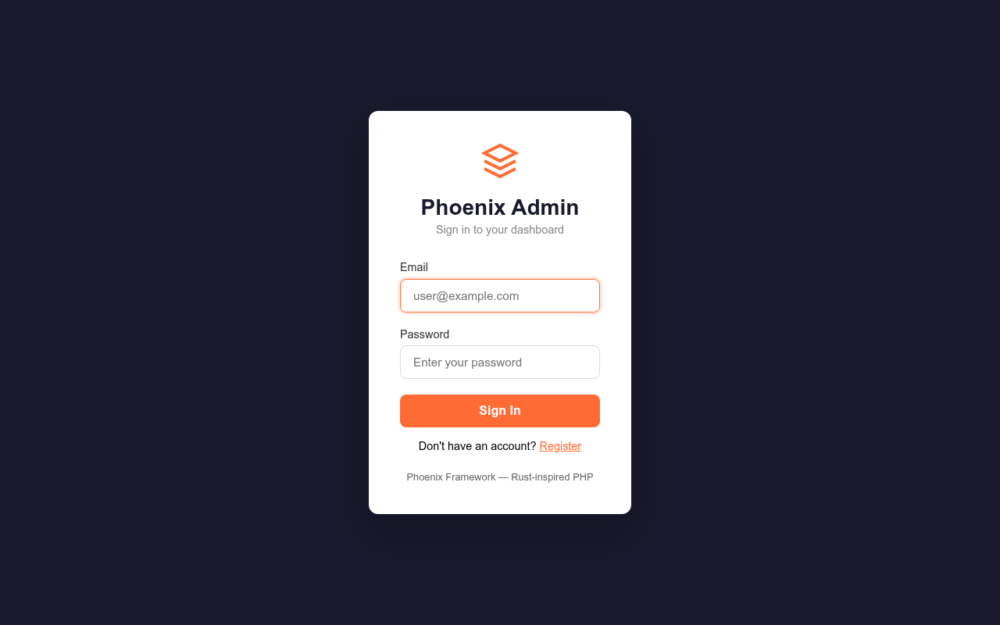
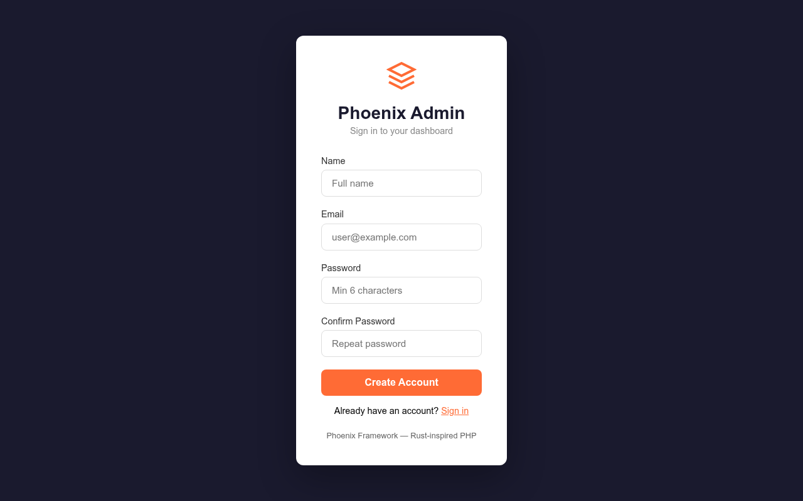
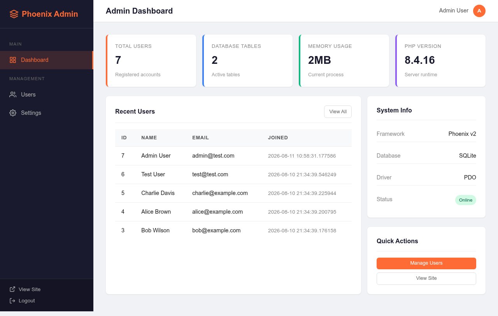
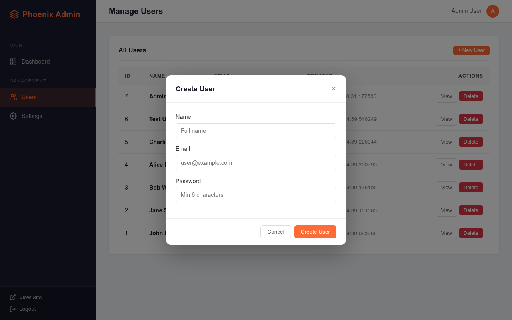
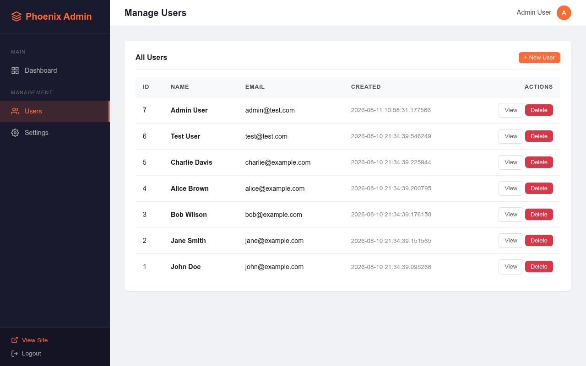

# Phoenix Framework v11

```
    ██████╗ ██╗  ██╗███████╗███╗   ██╗██╗██╗  ██╗
    ██╔══██╗██║  ██║██╔════╝████╗  ██║██║╚██╗██╔╝
    ██████╔╝███████║█████╗  ██╔██╗ ██║██║ ╚███╔╝
    ██╔═══╝ ██╔══██║██╔══╝  ██║╚██╗██║██║ ██╔██╗
    ██║     ██║  ██║███████╗██║ ╚████║██║██╔╝ ██╗
    ╚═╝     ╚═╝  ╚═╝╚══════╝╚═╝  ╚═══╝╚═╝╚═╝  ╚═╝ v11
```

**The Final Evolution** — Multi-chain · AI Agents · Real-Time · Secure

Phoenix is a modern, Rust-inspired PHP 8.2+ framework combining MVC + MVVM architectures with functional programming patterns. Zero singletons. Zero unsafe unwraps. Pure type safety.

---

## Admin Dashboard

### Login


### Register


### Dashboard


### Users Management


### Create User


### User Profile


---

## Features

- **Core** — Container (PSR-11), Result monad, Service Locator, Collection, Ref, Newtype
- **State Machine** — Exhaustive match, sealed states, typed transitions
- **Database** — PDO connection, Repository pattern, ACID transactions
- **HTTP Router** — Fluent API, attribute-based routing
- **MVVM** — Reactive ViewModel with Observable trait
- **Cache** — PSR-16 FilesystemStore
- **View** — Blade-like templating with Factory pattern
- **Auth** — State machine-based user authentication with JWT support
- **WebSocket** — Pure PHP server with framing, PubSub, session management, file upload
- **Blockchain** — Bitcoin, Ethereum, Solana, Cosmos adapters (multi-chain)
- **AI Agents** — Base Agent class with CryptoAgent for portfolio management
- **Event Sourcing** — Events, Aggregates, Event Store
- **CQRS** — Command Bus + Query Bus
- **Saga** — Distributed transactions with compensation
- **Middleware** — Kernel-based pipeline
- **Rate Limiting** — File-based rate limiter
- **Idempotency** — Duplicate request protection
- **Distributed Locks** — File-based locking
- **Console CLI** — `info`, `serve`, `make:controller`, `make:agent`, `route:list`, `cache:clear`
- **Notifications** — FCM service (stub), Pusher (real-time)

---

## Requirements

- PHP 8.2+
- Composer

---

## Installation

```bash
git clone <repo-url> phoenix
cd phoenix
composer install
```

---

## Quick Start

### Web Server

```bash
php phoenix serve
# Open http://127.0.0.1:8000
```

### CLI

```bash
php phoenix info
```

### Run Tests

```bash
php vendor/bin/phpunit
```

---

## Project Structure

```
phoenix/
├── app/
│   ├── Agents/              # AI Agent classes
│   ├── Auth/                # User model + states
│   ├── Controllers/         # HTTP controllers
│   ├── Repositories/        # Database repositories
│   ├── Services/            # Business logic services
│   └── routes.php           # Route definitions
├── src/
│   ├── AI/                  # Agent, CryptoAgent
│   ├── Blockchain/          # Bitcoin, Ethereum, Solana, Cosmos adapters
│   ├── Cache/               # FilesystemStore (PSR-16)
│   ├── Console/             # CLI Application + Commands
│   ├── Core/                # Container, Result, Collection, Ref, Newtype
│   ├── CQRS/                # Command Bus, Query Bus
│   ├── Database/            # Connection, Repository, Transaction
│   ├── EventSourcing/       # Event, AggregateRoot, EventStore
│   ├── Http/                # Router
│   ├── Lock/                # DistributedLock
│   ├── Middleware/           # MiddlewareInterface, MiddlewareKernel
│   ├── MVVM/                # ViewModel
│   ├── Notifications/       # FcmService
│   ├── RateLimit/           # RateLimiter
│   ├── Realtime/            # Pusher
│   ├── Saga/                # Saga (compensation pattern)
│   ├── Support/             # helpers.php
│   ├── View/                # View, Factory
│   └── WebSocket/           # Server, Framing, PubSub, SessionManager, UploadHandler
├── tests/
│   └── Unit/                # PHPUnit tests
├── public/
│   └── index.php            # Entry point
├── phoenix                  # CLI entry point
├── composer.json
└── phpunit.xml.dist
```

---

## Usage Examples

### Result Monad (Safe Error Handling)

```php
use Phoenix\Core\Result;

$result = Result::ok(42);
$result->isOk();      // true
$result->unwrap();    // 42

$error = Result::err('something failed');
$error->isErr();      // true
$error->unwrapOr(0);  // 0 (safe default)
```

### State Machine

```php
use App\Auth\User;
use App\Auth\States\UserState;

$user = new User(1, 'John', 'john@example.com');
$user->state();                          // UserState::Guest
$user->transition(UserState::LoggingIn);
$user->login('password');                // returns Result
$user->state();                          // UserState::Authenticated
```

### AI Agent

```php
use Phoenix\AI\CryptoAgent;
use Phoenix\Blockchain\BitcoinAdapter;

$agent = new CryptoAgent('Trader', 'Crypto trading bot');
$btc = new BitcoinAdapter();
$btc->fund(1.5);
$agent->addWallet('btc', $btc);

$agent->getPortfolio();     // ['btc' => ['address' => '...', 'balance' => '1.50000000 BTC']]
$agent->analyze('balance'); // formatted portfolio string
```

### Blockchain

```php
use Phoenix\Blockchain\EthereumAdapter;

$eth = new EthereumAdapter();
$eth->fund(10.0);
$eth->getBalance();  // "10.000000 ETH"
$eth->send('0x...', 2.0);  // returns tx hash
```

### CQRS

```php
use Phoenix\CQRS\CommandBus;

$bus = new CommandBus();
$bus->register(CreateOrder::class, fn(CreateOrder $cmd) => [
    'id' => uniqid(),
    'total' => $cmd->amount,
]);

$result = $bus->dispatch(new CreateOrder(amount: 99.99));
```

### Saga (Distributed Transactions)

```php
use Phoenix\Saga\Saga;

$saga = new Saga();
$saga->addStep('reserve_stock', fn() => reserve($id), fn() => release($id));
$saga->addStep('charge_payment', fn() => charge($amt), fn() => refund($amt));
$saga->execute();  // auto-compensates on failure
```

### Rate Limiting

```php
use Phoenix\RateLimit\RateLimiter;

$limiter = new RateLimiter();
$limiter->attempt('api:127.0.0.1', 60, 60);  // 60 requests per minute
```

### WebSocket Server

```bash
php -r "
require 'vendor/autoload.php';
\$server = new \Phoenix\WebSocket\Server(8080);
\$server->run();
"
```

### Console CLI

```bash
php phoenix info                    # Framework info
php phoenix serve                   # Start dev server
php phoenix make:controller User    # Create controller
php phoenix make:agent Trader       # Create AI agent
php phoenix route:list              # List routes
php phoenix cache:clear             # Clear cache
```

---

## Architecture

Phoenix follows these design principles:

- **No singletons** — dependency injection via Container
- **No unsafe unwraps** — Result monad for all fallible operations
- **Exhaustive matching** — sealed state machines prevent invalid transitions
- **Immutability** — readonly properties, typed enums, pure functions
- **Composition over inheritance** — traits, interfaces, closures
- **File-based defaults** — works without Redis, MySQL, or any external service

---

## License

MIT
